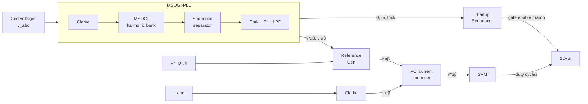

# 2LVSI_Control
Grid Following and Grid Forming implementations in a 2LVSI simulated in PLECS
# 2LVSI Control

Control of a **two-level voltage source inverter (2LVSI)**, simulated in PLECS:

- **Grid-Following** — full current-controlled inverter, with the control implemented as reusable **C modules** (each a `.c`/`.h` pair) called from PLECS C-Script blocks.
- **Grid-Forming** — dispatchable Virtual Oscillator Control (**dVOC**), implemented natively in PLECS.

Each block that needs it has a PDF next to it documenting the theoretical background of the implementation.

## Repository layout

```
Code/                        C control blocks (.c + .h + docs PDF)
├── Clarke/                  ABC ↔ αβ0 transform
├── Park/                    αβ0 ↔ dq0 transform
├── PI_Controller/           Discrete PI (with anti-windup and feed-forward variant)
├── Low_Pass_Filter/         1st-order LPF (bilinear transform)
├── Notch_Filter/            2nd-order notch filter
├── DSOGI_MSOGI/             DSOGI, MSOGI harmonic bank, sequence separator, MSOGI-PLL
├── Reference_Gen/           Current reference generator (CBC ↔ IPC blend)
├── PCI/                     Proportional + Complex-Integrator current controller (αβ)
├── SVM/                     Space-vector PWM (duty-cycle output)
└── Startup_Sequencer/       Grid-connection state machine (SYNC → RAMP → RUN)

Plecs Simulations/
├── Grid Following/          Grid_Following.plecs (uses the C blocks above)
└── Grid Forming/            Grid Forming_dVOC.plecs + documentation
```

## Grid-Following control architecture



### C modules

| Block | Files | Purpose |
|---|---|---|
| **Clarke** | `Clarke/` | ABC ↔ αβ0 transformation (amplitude-invariant). |
| **Park** | `Park/` | αβ0 ↔ dq0 rotation by the PLL angle θ. |
| **PI** | `PI_Controller/` | Discrete PI with output saturation; feed-forward variant with anti-windup. |
| **LPF / Notch** | `Low_Pass_Filter/`, `Notch_Filter/` | Discrete filters (bilinear transform) used for signal conditioning. |
| **DSOGI** | `DSOGI_MSOGI/dsogi.*` | Two SOGIs in quadrature (α and β); adaptive-frequency band-pass giving `v` and its 90°-lagged `qv`. AB3 integration with Euler/AB2 startup. |
| **MSOGI** | `DSOGI_MSOGI/msogi.*` | Bank of DSOGIs in a cross-decoupling network (CDN), one per harmonic (e.g. 1st, 5th, 7th) — isolates the fundamental on distorted grids. |
| **Sequence separator** | `DSOGI_MSOGI/sequence_separator.*` | Positive/negative symmetric components in αβ from the fundamental DSOGI. |
| **MSOGI-PLL** | `DSOGI_MSOGI/msogi_pll.*` | Full synchronization chain (Clarke → MSOGI → SeqSep → Park → PI): outputs θ, ω, sequence voltages and a lock flag. Robust to unbalance and harmonics. |
| **Reference Gen** | `Reference_Gen/` | αβ current references from P\*, Q\* under unbalanced/distorted voltage. Blends **CBC** (k=0: sinusoidal currents, power ripple) and **IPC** (k=1: constant power, distorted currents) with a weight k ∈ [0,1]. Stateless. |
| **PCI** | `PCI/` | Current controller in the stationary αβ frame: proportional gain + bank of **complex integrators**, each resonant at a signed harmonic `n·ω` (+1, −1, +5, −5, …). Includes leakage (finite resonator gain) and loop-delay compensation. |
| **SVM** | `SVM/` | Space-vector modulation producing phase duty cycles from `v*αβ` and the DC-link voltage; PWM edges are generated by a native PLECS carrier/comparator. |
| **Startup Sequencer** | `Startup_Sequencer/` | One-shot connection state machine: **SYNC** (gates blocked, PLL locking) → **RAMP** (soft-start of the current reference) → **RUN**. |

## PLECS simulations

Both models embed the C code through **C-Script blocks** with relative includes
(e.g. `#include "../../Code/PCI/pci.c"`), so the folder structure must be kept intact.
No external toolchain is needed — PLECS compiles the C-Scripts itself.

### Grid Following (`Grid_Following.plecs`)
2LVSI (800 V DC-link, RL filter) tied to a 220 V / 50 Hz grid with programmable
distortion (15% 5th, 10% 7th harmonic). Control runs at Fs = 40 kHz. Exercises the whole
chain of the diagram above; P\*, Q\*, the CBC/IPC weight `k` and the wideband-IPC option
are exposed as global parameters.

### Grid Forming (`Grid Forming_dVOC.plecs`)
Grid-forming inverter using **dVOC** (dispatchable Virtual Oscillator Control) in per-unit,
at a 100 MVA / transmission-voltage scale. The scenario scripts load steps and
grid connection/disconnection to show black-start, islanded operation, synchronization
and grid-tied operation. Theory in `Grid Forming Documentation.pdf`.

## Requirements

- [PLECS](https://www.plexim.com/) 5.0 or later (standalone). Plain C99, no external libraries.
